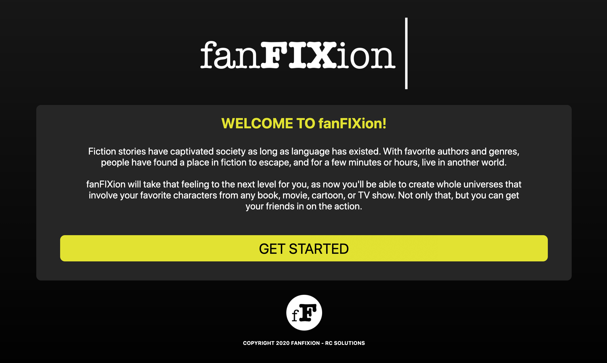
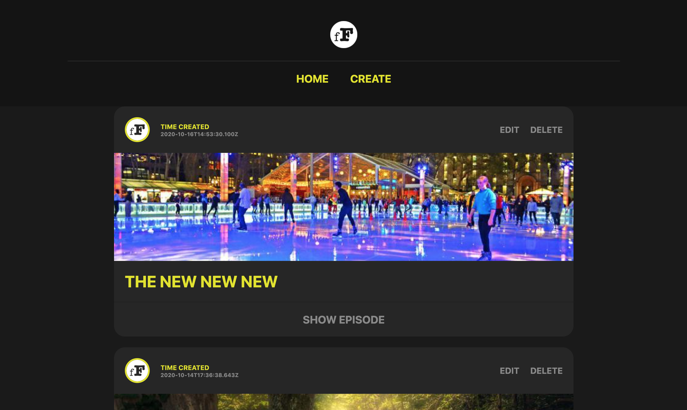
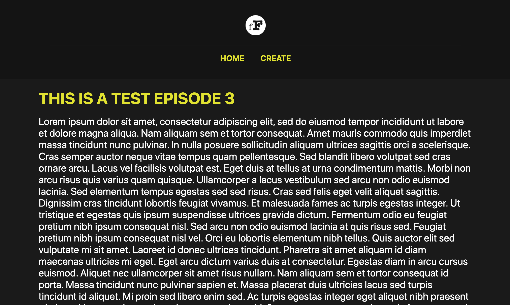
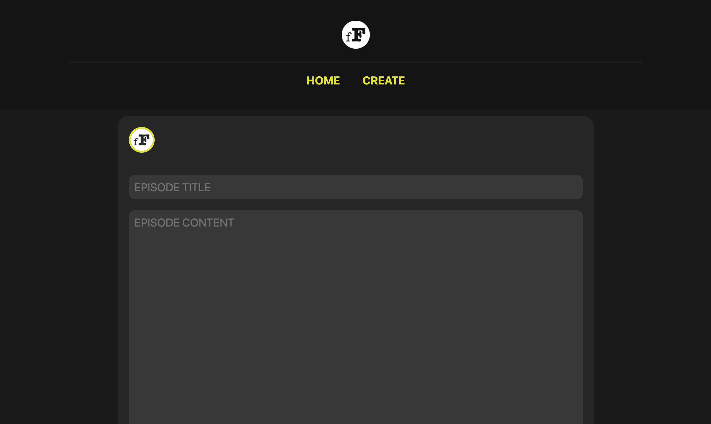
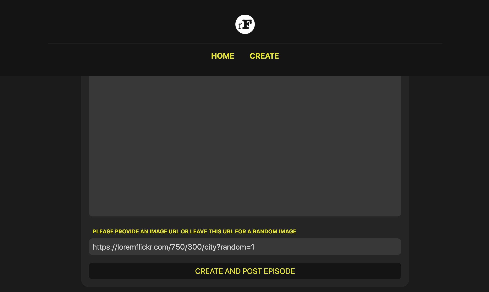
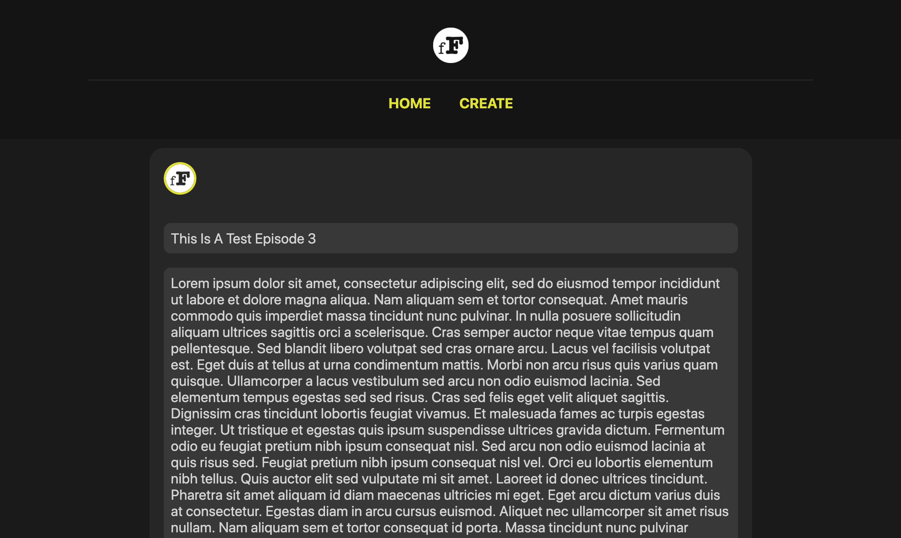
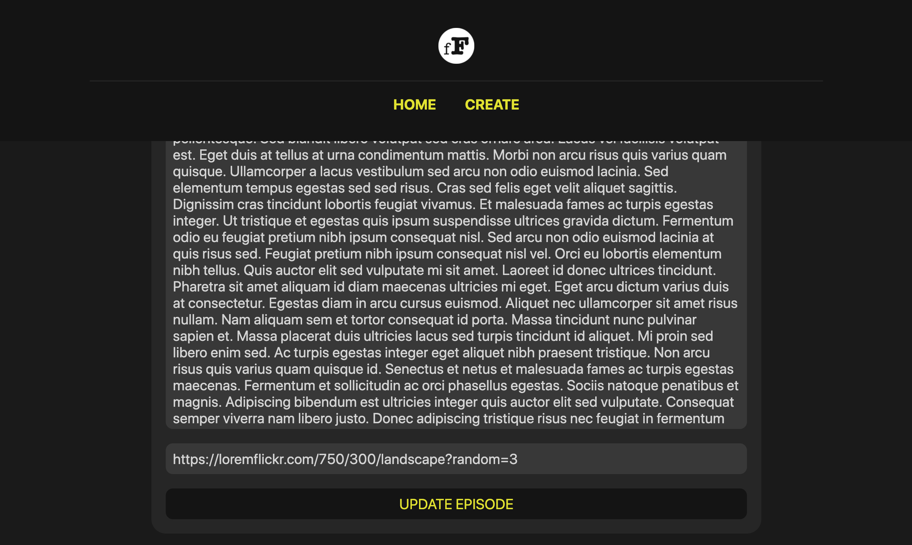

# fanFIXion

The name of my app is fanFIXion.
This is a fun platform where a user can become a member in a world of make-believe. Really, many worlds...
fanFIXion is not just a platform to connect with a community of like-minded individuals around a particular hobby-based interest, although I want there to be plenty of that.
It is an open source digital space that is actively being evolved and created by the user.

### Fiction stories have captivated society as long as language has existed.
With favorite authors and genres, people have found a place in fiction to escape, and for a few minutes or hours, live in another world. fanFIXion takes that feeling to the next level for it's users as now they'll be able to create whole universes that involve their favorite characters from any book, movie, cartoon, or TV show. Not only that, but they can get their friends in on the action. Eventually I see a platform that transforms the writing industry and allows an aspiring author to gain a following
much like content-creators do on sites like YouTube. The sky is the limit for the user. 

## Some Future Goals For fanFIXion
- You'll be able to follow different fictional universes and stay up to date on the latest developments in a favorite story written by a friend or a writer you follow.
- Collabarote as users can create fantastical worlds and storylines of your favorite fictional characters together.

## The imagination possibilities are endless!

### Be Sure To Check Out The App Using The Link Below!
[fanFIXion](https://fanfixion-client.vercel.app/)

## App Screenshots

### Landing Page

### Home/Episode Feed

### Episode Page

### Create Page

### Update Page

## App Summary
As a user, one is able to GET STARTED and view the episode feed of various fictional stories from the
home page. Once in the home page the user can, at this stage of the app, do four basic things.
- They can open a desired episode by clicking on the associated 'SHOW EPISODE' link.
- They can create and episode by clicking the 'CREATE' link in the navigation bar.
    - The user will be given fields for an Episode Title, Content, and an Image URL.
- They can update/edit a desired episode by clicking on the associated 'EDIT' link.
- And finally they can remove a desired episode by clicking on the associated 'DELETE' link.

## Codebase Details
This App was built with create-react-app

### Coding Used:
- Javascript
- CSS
- HTML
- React